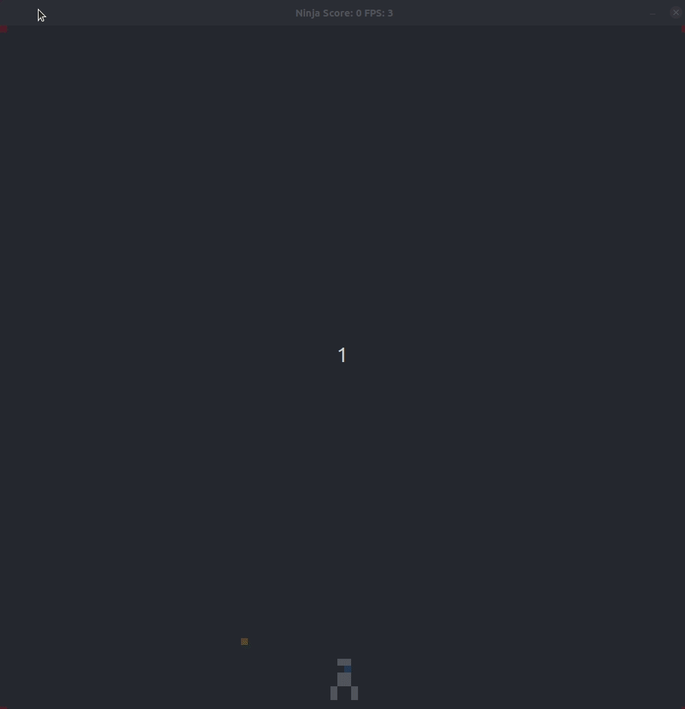

# CPPND: Capstone Ninja Game 

Ninja game is based on Capstone Snake Game repo for the Capstone project in the [Udacity C++ Nanodegree Program](https://www.udacity.com/course/c-plus-plus-nanodegree--nd213). This game is inspired from NV2 game [this](https://www.thewayoftheninja.org/nv2.html?l=570).

## Dependencies for Running Locally
* cmake >= 3.7
  * All OSes: [click here for installation instructions](https://cmake.org/install/)
* make >= 4.1 (Linux, Mac), 3.81 (Windows)
  * Linux: make is installed by default on most Linux distros
  * Mac: [install Xcode command line tools to get make](https://developer.apple.com/xcode/features/)
  * Windows: [Click here for installation instructions](http://gnuwin32.sourceforge.net/packages/make.htm)
* SDL2 >= 2.0
  * All installation instructions can be found [here](https://wiki.libsdl.org/Installation)
  >Note that for Linux, an `apt` or `apt-get` installation is preferred to building from source. 
* gcc/g++ >= 5.4
  * Linux: gcc / g++ is installed by default on most Linux distros
  * Mac: same deal as make - [install Xcode command line tools](https://developer.apple.com/xcode/features/)
  * Windows: recommend using [MinGW](http://www.mingw.org/)

## Basic Build Instructions

1. Clone this repo.
2. Make a build directory in the top level directory: `mkdir build && cd build`
3. Compile: `cmake .. && make`
4. Run it: `./NinjaGame`.

## Description

Gold hungry Ninja needs to avoid bullets fired by tanks located in 4 corners to save the world!!! Ninja speed increases with each gold and bullets can see ninja when vertically alligned with the bullet.

## Rubric Points

* The project demonstrates an understanding of C++ functions and control structures. can be seen in bullet.cpp in class Bullet

* The project uses Object Oriented Programming techniques. bullet.h line 38 in the new class "Bullet"

* Classes use appropriate access specifiers for class members. bullet.h line 73 in the new class "Bullet"

* Class constructors utilize member initialization lists. tank.h line 14 in the new class "tank"  

* Classes encapsulate behavior. snake.h line 18 in the new class "Food" encapsulate "FoodType"

* The project uses multithreading. Bullet.cpp line 36 in creating a thread to update bullet position being fired. 

* A condition variable is used in the project.  Bullet.cpp line 13.

* A mutex or lock is used in the project. Bullet.cpp line 10.

* The project uses move semantics to move data, instead of copying it, where possible. Bullet.cpp line 76.

* The project uses smart pointers instead of raw pointers. game.h line 21

## Known Issues

* Game needs to be force closed.

